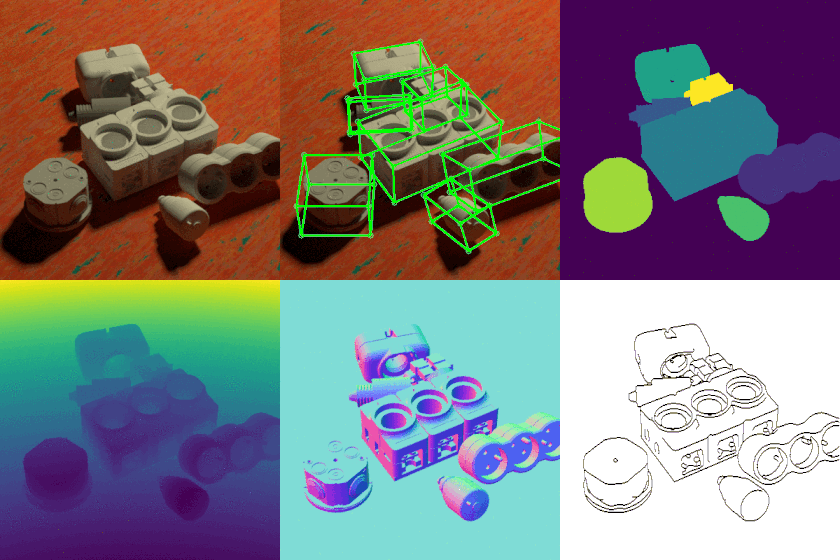

# SyntheT-Less
Official repository for the SyntheT-Less dataset 

used in *On Object Symmetries and 6D Pose Estimation from Images*, G. Pitteri\*, M. Ramamonjisoa\*, S. Ilic and V. Lepetit




# Download our data
The data is available [here](https://drive.google.com/open?id=1VCYiN4truBKsYwAUlgn1td_TUZL8qyD0) (9.6GB zip file).

# Dataset structure
Here is how the dataset is organised:

```
multi_objects/
|__images
    |__ img_xxxxx.png
|__contours/
    |__ xxxxx.png
|__depth/
    |__ xxxxx.png                         
|__normals
    |__ xxxxx.png
|__mask
    |__ xxxxx.png
|__instances
    |__ xxxxx.png --> uint8 image containing object labels from 1 to 9 (background pixels are annotated with 0) 
|__gt_poses/
    |__ tmp_xxxxx.json --> contains a dictionnary of object poses with keys annotated from 0 to 8 
                           (There is a 1-shift from object instances indices, sorry about that!)
        {
         "0": {"Euler": [theta_x, theta_y, theta_z],
               "T": [Tx, Ty, Tz],
               "type": object type from T-LESS (from 1 to 30)},              
         ...
                  
         "8": {"Euler": [theta_x, theta_y, theta_z],
               "T": [Tx, Ty, Tz],
               "type": object type from T-LESS (from 1 to 30)},
         "Lamp": {"phi": lamp_phi, 
                  "theta": lamp_theta,
                  "strength": lamp_strength
                  "Ambient Light": ambient occlusion level (0 to 1)
                  "Table": {"distance": distance in meters,
                            "Euler": [theta_table_x, theta_table_y, theta_table_z]}
         }   

```

# Data Generation 

## Requirements
### 1. Download the DTD dataset
Download the [Describable Textures Dataset (DTD)](https://www.robots.ox.ac.uk/~vgg/data/dtd/) and set its folder using:

```
cd DTD
wget https://www.robots.ox.ac.uk/~vgg/data/dtd/ -O && unzip dtd-r1.0.1.tar.gz && cd .. 
rm -rf DTD/dtd-r1.0.1.tar.gz
```

### 2. Download the T-Less CAD models
```
wget http://ptak.felk.cvut.cz/darwin/t-less/v2/t-less_v2_models_cad.zip
unzip t-less_v2_models_cad.zip  
```

### 3. Install Blender
These commands will install [Blender](https://www.blender.org/download/Blender2.80/blender-2.80-linux-glibc217-x86_64.tar.bz2/)
 and set it to the correct path. Skip this step if you have already installed Blender.

```
wget https://www.blender.org/download/Blender2.80/blender-2.80-linux-glibc217-x86_64.tar.bz2/  
bzip2 -d blender-2.80-linux-glibc217-x86_64.tar.bz2
mkdir blender && tar -xf blender-2.80-linux-glibc217-x86_64.tar -C blender/ --strip-components=1
```

## Run the generation code

Make sure you have installed the following requirements:
- [Blender](https://www.blender.org/download/Blender2.80/blender-2.80-linux-glibc217-x86_64.tar.bz2/) (in previous step)
- OpenCV
- OpenEXR
- imageio

Then run:
```
python3 call_blender_multi.py --blender_path $BLENDER_PATH \
			      --dtd-rootdir DTD \
			      --models_path models_cad\
			      --cpus $NUM_CPUS --size $DATASET_SIZE --cuda $CUDA_DEVICE
```

Variables:

- $BLENDER_PATH: Path to the directory containing your Blender executable (use Blender/ if installed with step 3)
- $NUM_CPUS: Number of processes to run data generation in parallel. We recommand setting it to your machine CPUs number.  
- $DATASET_SIZE: Aimed dataset size
- $CUDA_DEVICE: GPU ID for data generation

Call **python3 call_blender_multi.py --help** for help on other parameters.

# Citation
If you use our data generation code or already generated data, please cite our paper:

```
@article{pitteri2019threedv, 
 Title = {On Object Symmetries and 6D Pose Estimation from Images}, 
 Author = {G. Pitteri and M. Ramamonjisoa and S. Ilic and V. Lepetit}, 
 Journal = {International Conference on 3D Vision}, 
 Year = {2019}
 }
```
